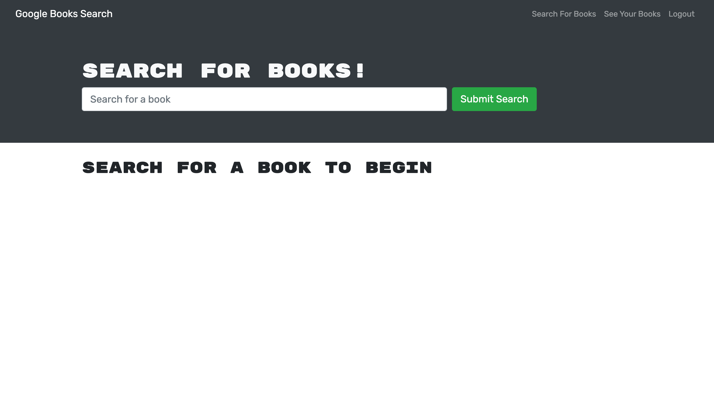

# book-search-engine

This application is a functional book search engine, that allows a user to browse various books, searched by name and sourced from the Google API, to signup, login, save books to a collection for later reference, and also delete books from their collection.

